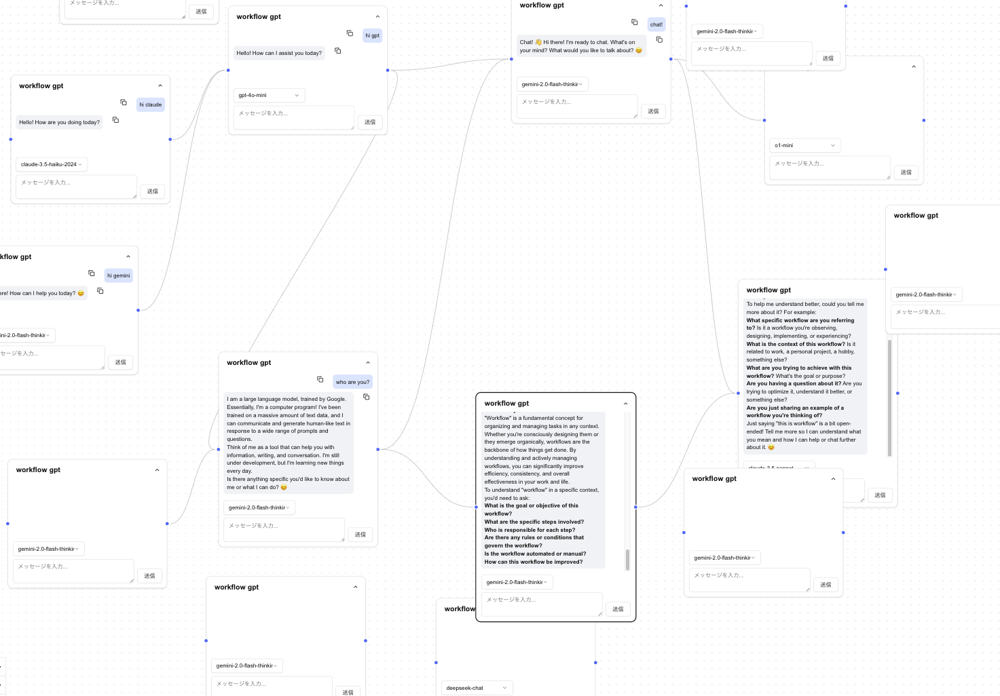

# Workflow GPT

Workflow GPT は、AI チャットの会話をフローチャートとして視覚化し、複数の会話を関連付けて管理できるアプリケーションです。



## 特徴

- 🎯 **会話のフロー管理**: チャットをノードとして配置し、関係性を可視化.子ノードが親ノードのチャットを参照することで、会話のフローを管理.
- 🤖 **複数の AI モデル**: 各ノードで異なる AI モデルを選択可能
- 🎨 **モダンな UI**: shadcn/ui を使用したスタイリッシュなデザイン
- 🌓 **ダークモード**: システム設定に応じた自動切り替え

## 技術スタック

- **フロントエンド**

  - Next.js (App Router)
  - TypeScript
  - Tailwind CSS
  - shadcn/ui
  - ReactFlow

- **バックエンド**

  - Supabase

- **AI/ML**
  - Vercel AI SDK

## 開発環境のセットアップ

### インストール

1. リポジトリのクローン:

   ```bash
   git clone https://github.com/champaya/workflow-gpt.git
   cd reactflow-chat
   ```

2. 依存関係のインストール:

   ```bash
   pnpm install
   ```

   or

   ```bash
   npm install
   ```

3. 環境変数の設定:

   ```bash
   cp .env.example .env.local
   ```

4. 環境変数の編集:

   ```bash
   NEXT_PUBLIC_SUPABASE_URL=your_supabase_url
   NEXT_PUBLIC_SUPABASE_ANON_KEY=your_supabase_anon_key
   NEXT_PUBLIC_URL=your_app_url
   OPENROUTER_API_KEY=your_openrouter_api_key
   GOOGLE_GENERATIVE_AI_API_KEY=your_google_generative_ai_api_key
   PERPLEXITY_API_KEY=your_perplexity_api_key
   ```

5. 開発サーバーの起動:

   ```bash
   pnpm dev
   ```
   
   or

   ```bash
   npm run dev
   ```

   アプリケーションは http://localhost:3000 で利用可能になります。

## アプリケーション構造

```
.
├── app/ # Next.js アプリケーションルート
│ ├── api/ # API エンドポイント
│ ├── login/ # ログイン関連
│ ├── error/ # エラーページ
│ └── workflow/ # ワークフロー関連
├── components/ # React コンポーネント
│ ├── common/ # 共通コンポーネント
│ ├── ui/ # shadcn/ui コンポーネント
│ └── workflow/ # ワークフロー関連コンポーネント
├── db/ # データベース設定関連
│ └── trigger/ # データベーストリガー
├── public/ # 静的ファイル
├── types/ # TypeScript 型定義
└── utils/ # ユーティリティ関数
```

## 主要機能の解説

### ワークフローの作成と編集

1. ノードの追加:

   - キャンバス上で右クリック
   - 既存ノードから Tab キーを押下
   - ノード間をドラッグ&ドロップ

2. ノードの接続:

   - ノードの左右のハンドルをドラッグして接続
   - 循環参照は自動的に防止

3. チャットの操作:
   - 各ノードで AI モデルを選択可能
   - メッセージの送信は Command/Ctrl + Enter で実行
   - チャット履歴は自動保存

## 開発者向け

### Next.js 関連

- AI モデルの設定は utils/ai/model.ts を編集してください。AI SDK を利用しております。
- ノードのチャットと、サイドバーのチャットは utils/event-bus.ts で同期されます。

### supabase 関連

- DB のスキーマは db/ddl.sql を参照してください。

- middleware や client の設定は下記ページを参考に作成しています。  
  https://supabase.com/docs/guides/auth/server-side/nextjs

- google 認証は下記ページを参考に作成しています。  
  https://supabase.com/docs/guides/auth/social-login/auth-google?queryGroups=platform&platform=web

- データベースセキュリティは RLS で担保する設計となっております。各ユーザーが自分のチャットのみを操作できるように設定してください。

- app/api/workflow/node の POST と DELETE はトランザクション処理に修正する方が適切です。supabase では RPC でトランザクション管理が可能です。

- reactflow_message テーブル の content が jsonb の理由は、チャット履歴に画像などの情報も作成できるように拡張性を見込んだものとなっております。現在は{type: "text", text: "..."}としてデータが格納されます。

### 重要：データの持ち方
当アプリケーションはチャットの１メッセージを１行として保存しています。
ただし、このデータの持ち方は必ずしも最良ではないと考えています。次の考え方でデータの持ち方を決定することをおすすめします。
1. 当アプリケーションを統合し、既存のDBと共通してメッセージをデータとして持ちたい→既存システムにmessagesテーブルのようなものがあり、１メッセージ1行でデータを持っているのであれば簡単に当アプリケーションをほぼそのまま統合できます。
2. 当アプリケーションを使って新しいものを作りたい→スクラッチでの開発をお勧めします。ワークフローのデータはワークフローそのものをJSONBデータとして保持することが適切だと思います。これには、「スキーマ変更が容易」「データを保存するタイミングの検知がJSON変更のタイミングで共通化できる」といった利点があり、ベストプラクティスだと考えています。当アプリケーションを拡張する形ではなく、思い切ってデータ構造からやり直した方が将来の拡張性が見込めます。


## ユーザ様の声

当アプリケーションは少しの間、web アプリケーションとして公開しておりました。ユーザ様からのフィードバックを記載します。
機能追加のヒントとしていただけると幸いです。

- AI で自動的に次ノードも作成してくれると嬉しい
- ワークフロー作成時に最初のノードを自動的に作成してくれると嬉しい
- 右クリックのメニュー表示が気付きにくい
- サンプルプロジェクトがあるとわかりやすくなりそう
- テンプレートに沿った出力が欲しい
- LLM の出力を再生成できる機能が欲しい
- 同じ形式のワークフローを違うテーマで使いまわせる仕組みが欲しい

## ライセンス

MIT License

## お問い合わせ

https://x.com/cham_paya
